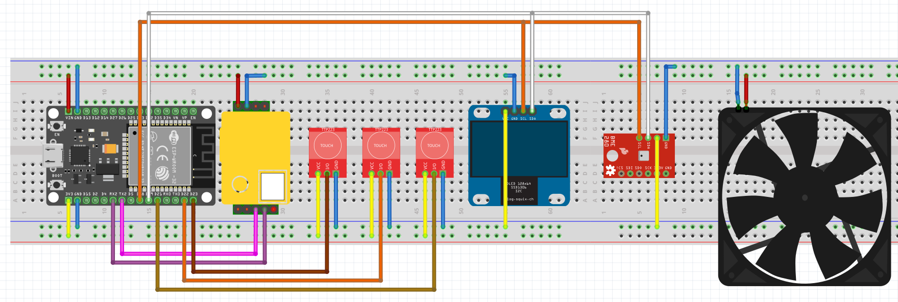

# CO2-ESP32
Arduino CO2 and Temperature logger based on BOSCH BME280 and Winsen MH-Z19B

## Functions
- Shows C02, Temperature, Humidity, Pressure
- Temperature (and humidity) can be corrected, if the BME280 if off calibration
- Thingspreak implementation including WiFi access

## Parts needed
- DOIT! ESP32 (any ESP32 should work, might not fit in the case)
- OLED 0.97" 128x64 Display
- MH-z19B CO2 sensor
- BME280 sensor

    -> I'll had a 5V compatible version
    
    -> Make shure you connect it to 3.3V if you don't have

## Shematics

### User Interface
General Interface

### Log

